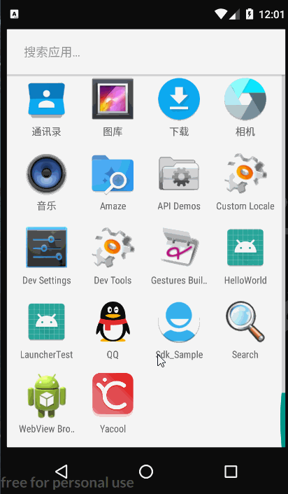

# LauncherTest

一个简单的仿 Launcher 应用

## 本例实现两个功能：
1. 系统桌面上的app图标能够排列在我们的页面上。 
2. 点击自定义桌面上的app图标,能够打开对应的app。

## 实现思路：
1. 我们知道，一个应用的启动页 Activity 的 Intent 的 filter 中 包含 `action` 为 `Intent.ACTION_MAIN`和`category`为 `Intent.CATEGORY_LAUNCHER` 信息，我们构造一个这样的 Intent 来查询所有启动页 Activity 。
2. 用一个 RecyclerView 来展示信息。
3. 通过 Intent 跳转到对应 app 的主页面。

运行效果如图：

